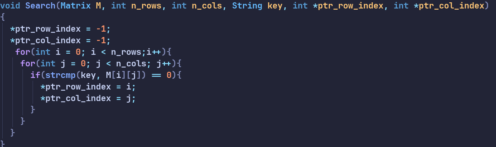

# _String Manipulation_  
February 10, 2024	
By: Philip Martin Antolihao
> This program uses the `INPUT.txt` file to automate testing. read the README file to know what each is for.

## Populate function

> Why pointers? this because we need to return two values, usual functions can only return one.  

This function takes the data of for the number of rows and the number of columns for the table of strings. This means that our table could end up being much smaller than what was dictated in the `Matrix` type definition although note that it does dictate its maximum size
 
 The **`for`** loop, this a simple population nested loop iterates through every spot and fills it with strings dictated by the input file    

* _@param_ **Matrix M** - Matrix is a predefined 2d array of strings  
`typedef String Matrix[MAX_ROWS][MAX_COLS];`  
[ ! ] MAX ROWS and MAX COLS are globally defined fixed integers  

* _@param_ ***ptr_nRows** & ***ptr_ncols** - these variables are meant to contain the address of the variable that holds the integer value of rows and columns

_**The `scanf` function:**_ while using the `scanf` function there is no need to use the **&** symbol this is because these are inherently addresses already since they are pointers  
_**The parameters of the for loop**_: We dereferenced the pointers since we needed the actual integer value that is stored inside them

there is no return value for this function.

## Search Function

> note: the parameters contain the nRows and nCol as an integer now

This function iterates through each slot in the table and uses string compare to check the similarity between the key and the current string. When `strcmp` returns a zero the current index is saved into the `*ptr_row_index` and `*ptr_col_index`. The value of is set to **-1** these assumes not found, value is only updated when `key` and the string is equal.

* _@param_ `n_cols` and `n_row ` - integer value passed from the previous section there is no need to modify it, it is used for the `for` loop

* _@param_ `ptr_row_index` and `ptr_row_index` - this stores the value of the found index initially set to **-1** asusming not found

* _@param_ `Matrix M` - the table data

