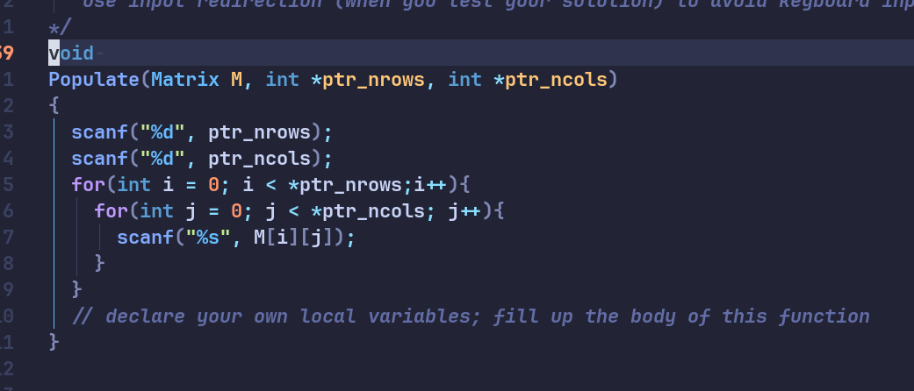

# _String Manipulation_  
February 10, 2024	
By: Philip Martin Antolihao
> This program uses the `INPUT.txt` file to automate testing. read the README file to know what each is for.

## Populate function

> Why pointers? this because we need to return two values, usual functions can only return one.  

This function takes the data of for the number of rows and the number of columns for the table of strings. This means that our table could end up being much smaller than what was dictated in the `Matrix` type definition although note that it does dictate its maximum size
 
 The **`for`** loop, this a simple population nested loop iterates through every spot and fills it with strings dictated by the input file    

* _@param_ **Matrix M** - Matrix is a predefined 2d array of strings  
`typedef String Matrix[MAX_ROWS][MAX_COLS];`  
[ ! ] MAX ROWS and MAX COLS are globally defined fixed integers  

* _@param_ ***ptr_nRows** & ***ptr_ncols** - these variables are meant to contain the address of the variable that holds the integer value of rows and columns

_**The `scanf` function:**_ while using the `scanf` function there is no need to use the **&** symbol this is because these are inherently addresses already since they are pointers  
_**The parameters of the for loop**_: We dereferenced the pointers since we needed the actual integer value that is stored inside them

there is no return value for this function.

## Search Function

> note: the parameters contain the nRows and nCol as an integer now

This function iterates through each slot in the table and uses string compare to check the similarity between the key and the current string. When `strcmp` returns a zero the current index is saved into the `*ptr_row_index` and `*ptr_col_index`. The value of is set to **-1** these assumes not found, value is only updated when `key` and the string is equal.

* _@param_ `n_cols` and `n_row ` - integer value passed from the previous section there is no need to modify it, it is used for the `for` loop

* _@param_ `ptr_row_index` and `ptr_row_index` - this stores the value of the found index initially set to **-1** asusming not found

* _@param_ `Matrix M` - you know what this is..

## Transpose

> note: a seperate table is made here to write on to, the original copy remains unmodified 

This function is is just a simple subtitution where the row indices get swapped with column indices making the columns the rows and vice versa 

A simple loop just switches the two.

* @param `Matrix T` - the seperate table that is to be transposed
* @param `Matrix M` - the source table, original
* @param `n_rowsM` & `n_colsM` - integer values of row and columns for `for` loop purposes

## Filter
Objective: Find all the word in the table that contains the letters in the `filter` string. If the word contains it add `+` to the start and end of the word, and if not add `-`. Example `+HELLO+` or `-GREEN-`

> Figure: this is the loop to access each needed area

The first two loop declaratiosn access the rows and columns of matrix m, they are so that we can access each word of that table. 

Note that filter is a `*filter` this is a pointer, this means that it is most likely a string, we are dealing with filters with more than one letter to check, this means we have to loop through each letter to comapre it

#### Detecting  Mechanism and counter
> For succeeding explanations, assume `*filter` is **"EO"** and all words are **UPPERCASE**

We have two detection counters, `per_letter` & `per_word`. Since the word, may contain one of the filter letters multiple times like "Green", it may create instances with a false positive as E occurs twice in the word giving the expression that the two letter filter is met. To avoid this, we count the instance of multiple letters as one, so when 'E' appears twice in **"Green"** it may run up the `per_letter` variable twice it will only count up the `per_word` variable once. 

At the end the `per_word` is what is evaluated. At the end, for it to pass, `per_word` must be equal to the string length of `*filter`. **Each letter of the `*filter` string must appear once in the word to pass**

#### Marking Mechanism

> Figure: This if statement adds the `+ word +` or `- word -` mark to the appropriate sentences 

This is just a simple concatenate snippet where it adds a string next to another just note that `pos[2]` and `neg[2]` contain "+" and
 "-" respectively. 
 
 I guess its also important that this new string is copied from the temp var to the new and final location of the same index as the `Matrix M` but now in `Matrix T`

